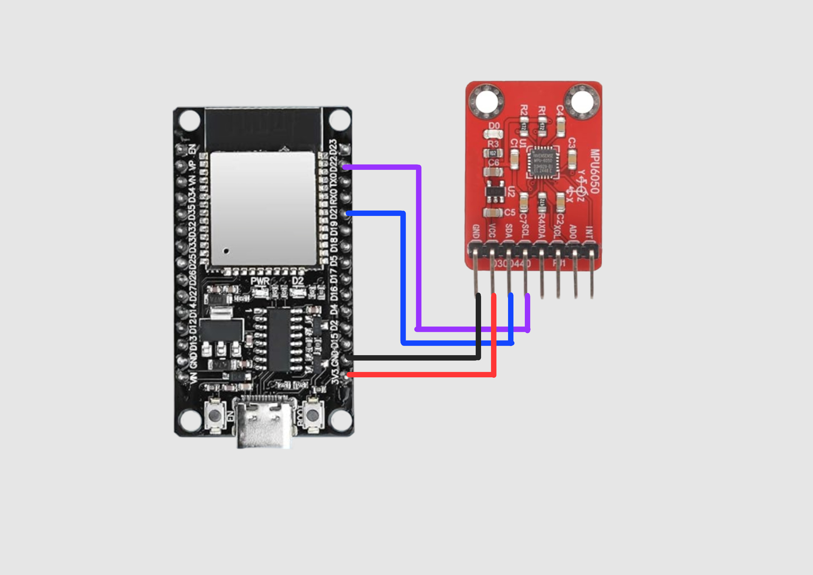
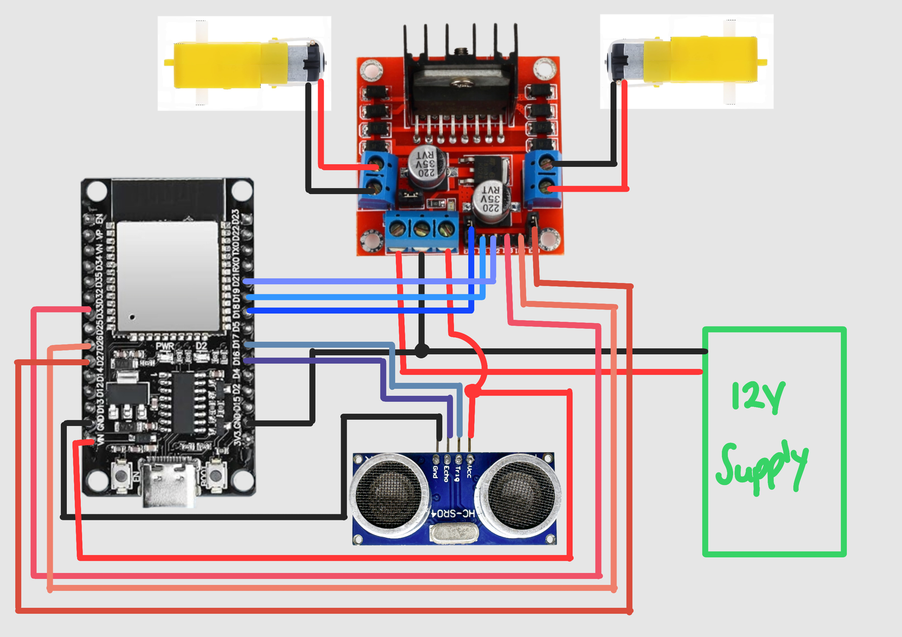

# Hand Gesture Controlled Robot

A robot controlled by hand gestures using an MPU6050 accelerometer/gyroscope mounted on a glove. Tilting your hand in different directions sends movement commands wirelessly to the robot via ESP-NOW.

## How It Works

An MPU6050 sensor mounted on the index finger of a glove detects the tilt of your hand. An ESP32 on the glove reads the sensor data and sends movement commands wirelessly to a second ESP32 on the robot using ESP-NOW. The robot ESP32 then drives two DC motors via an L298N motor driver accordingly.

A heartbeat system ensures the robot stops automatically if the glove ESP32 goes offline or out of range. An HC-SR04 ultrasonic sensor on the front of the robot stops forward movement if an obstacle is detected within 20cm.

## Demo Video

## Gesture Controls

| Hand Tilt | Robot Action |
|-----------|-------------|
| Tilt up | Move forward |
| Tilt down | Move backward |
| Tilt left | Pivot left |
| Tilt right | Pivot right |
| Neutral/flat | Stop |

## Components

### Robot
| Component | Quantity | Details | Purpose |
|-----------|---------|---------|---------|
| ESP32 NodeMCU | 1 | 2.4GHz WiFi & Bluetooth | Receives gesture commands and controls the motors |
| L298N Motor Driver | 1 | Dual H-bridge | Drives both DC motors and supplies 5V to the HC-SR04 |
| 2WD Robot Chassis | 1 | Bought off Amazon | Physical base of the robot |
| DC Hobby Motors | 2 | Standard hobby motors | Moves the robot |
| HC-SR04 Ultrasonic Sensor | 1 | Front mounted | Detects obstacles and stops forward movement |
| AA Batteries | 8 | 12V total | Powers the motor driver, ESP32 and sensor |

### Glove
| Component | Quantity | Details | Purpose |
|-----------|---------|---------|---------|
| ESP32 NodeMCU | 1 | 2.4GHz WiFi & Bluetooth | Reads MPU6050 data and sends gesture commands to the robot |
| Hoite MPU6050 6-Axis Gyroscope Accelerometer (16-bit AD, DMP, IIC) | 1 | 6-axis accelerometer/gyroscope | Detects hand tilt direction |
| Winter glove | 1 | Used as the wearable base | Holds all components on the hand |

## Wiring

### MPU6050 — Glove ESP32  
| MPU6050 | ESP32 |
|---------|-------|
| VCC | 3.3V |
| GND | GND |
| SDA | D21 |
| SCL | D22 |

### L298N — Robot ESP32
| L298N | ESP32 |
|-------|-------|
| ENA | D18 |
| IN1 | D19 |
| IN2 | D21 |
| ENB | D27 |
| IN3 | D33 |
| IN4 | D26 |
| VCC | 12V (battery) |
| GND | GND (common) |

### HC-SR04 — Robot ESP32
| HC-SR04 | Details |
|---------|---------|
| VCC | L298N 5V out |
| GND | GND (common) |
| TRIG | D17 |
| ECHO | D16 |

## Schematics
<figure>
  
  <figcaption>Glove Wiring Schematic</figcaption>
</figure>

<figure>
  
  <figcaption>Robot Wiring Schematic</figcaption>
</figure>

## Safety Features

**Heartbeat system** — the glove ESP32 sends a heartbeat signal every 2 seconds even when no gesture is being made. If the robot ESP32 doesn't receive any signal for 10 seconds, the motors are stopped automatically. This prevents the robot from running indefinitely if the glove is switched off or goes out of range.

**Obstacle detection** — the HC-SR04 sensor on the front of the robot measures distance continuously during forward movement. If an obstacle is detected within 20cm, the forward command is ignored and the motors are stopped until the obstacle is cleared.

## Sketches

| Folder | Description |
|--------|-------------|
| `sender` | Final glove ESP32 code |
| `receiver_with_sensor` | Final robot ESP32 code with HC-SR04 |
| `receiver` | Robot ESP32 code without HC-SR04 |
| `mpu_test` | MPU6050 connection and reading test |
| `motor_test` | Motor direction and speed test |
| `motorb_test` | Isolated Motor B test |
| `mac_address_retrieve` | Retrieves ESP32 MAC address for ESP-NOW setup |

## Known Issues

- Securing the ESP32 to the glove is a challenge. Double sided tape was not strong enough. Currently figuring out a solution to this.
- D25 on the robot ESP32 behaved unexpectedly for motor control and was swapped out for D33.

## Possible Future Improvements

- Add a second HC-SR04 to the rear of the robot for backward obstacle detection

## Built With
- Arduino IDE — firmware
- C++ — programming language

## Libraries Used
- [MPU6050 by Electronic Cats](https://github.com/ElectronicCats/mpu6050) — reading accelerometer and gyroscope data from the MPU6050
- ESP-NOW — wireless communication between the two ESP32s (built into ESP32 Arduino core)
- Wire — I2C communication between the glove ESP32 and MPU6050 (built into ESP32 Arduino core)
- WiFi — required to initialise ESP-NOW as it runs on top of the ESP32 WiFi radio (built into ESP32 Arduino core)

## Author
[Elohim Dzangare](https://www.linkedin.com/in/elohim-dzangare/)
